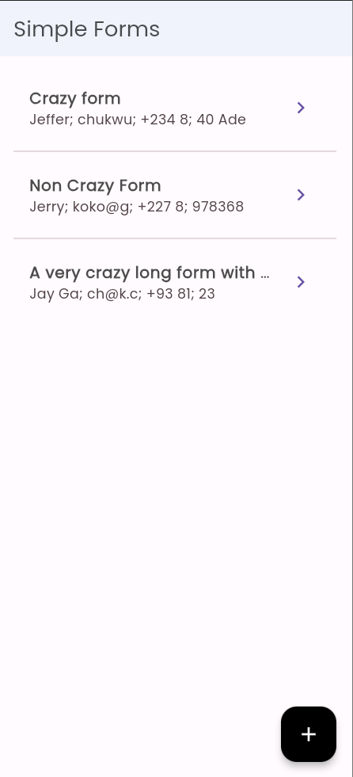
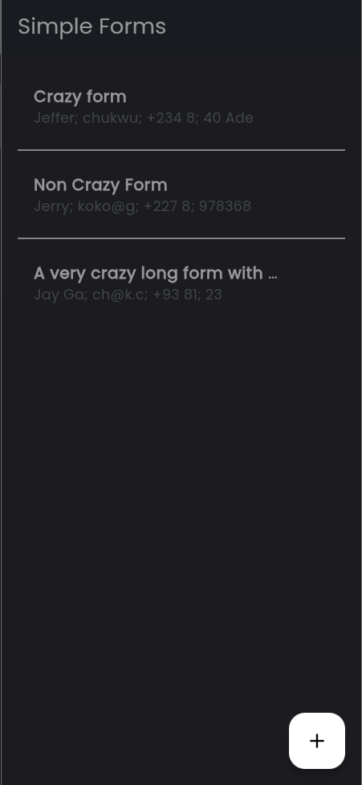
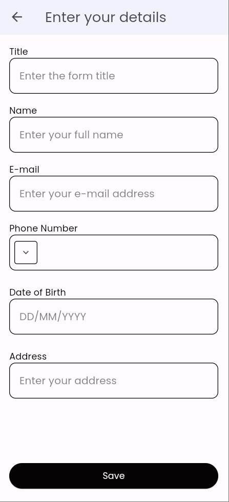
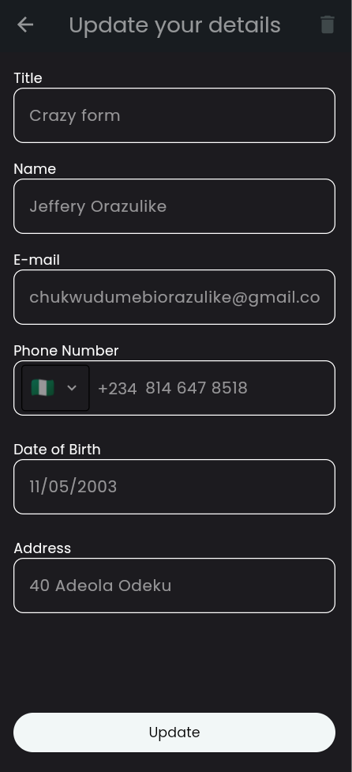

# Simple Flutter Form

A flutter project that shows a simple form with validation.

## Description

The simple form app is a simple flutter project that shows a form with validation. The form has multiple fields and can be saved locally and to Firebase Firestore. The app also has an auth screen that allows users to login with either their Google or Facebook account.

## Features

- [x] Form with validation
- [x] Save form locally
- [x] Save form to Firebase Firestore
- [x] Login with Google
- [x] Login with Facebook

## Screenshots

<table>
<tr>
<td valign="top" width="50%">

</td>
<td valign="top" width="50%">

</td>
</tr>

<tr>
<td valign="top" width="50%">

</td>
<td valign="top" width="50%">

</td>
</tr>

<tr>
<td valign="top" width="50%">

</td>
<td valign="top" width="50%">

</td>
</tr>
</table>

## App Demo

The apk to the app can be found in the actions tab

## Installation

Clone the repository from Github:

``` bash
git clone https://github.com/logickoder/simple_flutter_form.git
```

Navigate to the project directory:

``` bash
cd simple_flutter_form
```

Install firebase tools from npm to setup firebase features like authentication and firestore for your project:

```bash
npm install -g firebase-tools
```

Login to your firebase account:

```bash
firebase login
```

Install the firebase cli:

```bash
dart pub global activate flutterfire_cli
```

Initialize firebase for your project:

```bash
flutterfire configure
```

Get the project dependencies:

```bash
flutter pub get
```

Run the app on your emulator or physical device:

```bash
flutter run
```

## Requirements

- Flutter installed on your system
- Emulator or physical device for testing
- Firebase account

## Contributing

Contributions are welcome! Please feel free to fork the repository and submit pull requests. Make
sure to follow the existing code conventions and try to include tests with your changes.

## License

This project is licensed under the MIT License - see the LICENSE file for details.